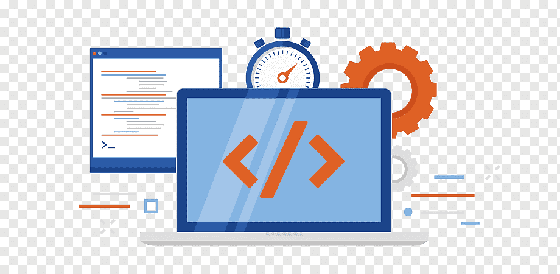
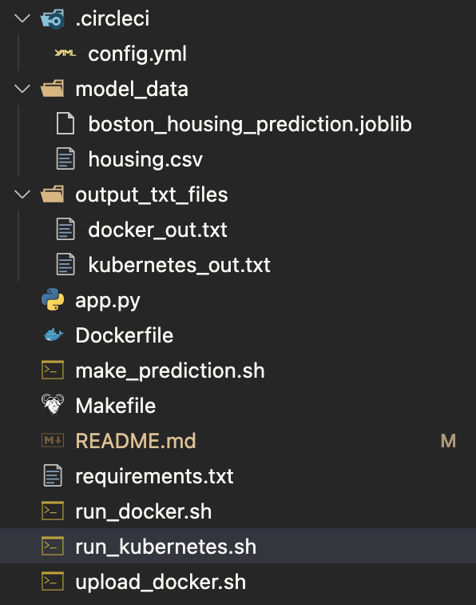

# Deploy Springboot App using Jenkins Pipeline, Amazon ECR and Amazon EKS

<div align="left">
    
</div>

## Project Overview

The goal of the project is to apply the skills and knowledge which were developed throughout the Cloud DevOps program. These include:
* Working in AWS
* Using Jenkins to implement Continuous Integration and Continuous Deployment
* Building pipelines
* Working with CloudFormation to deploy clusters
* Building Kubernetes clusters
* Building Docker containers in pipelines

## Prerequisites

To run and test the deployment locally, make sure that you have the following tools installed on your machine:
* Java
* Maven
* Docker
* kubectl
* Minikube

To deploy the application to Amazon EKS you also need the following tools:
* AWS CLI
* eksctl

## File Explanation

<div align="left">
    
</div>

- `Dockerfile`: text file that contains set of instructions for docker to automatically build an image for the app to be run in a container
- `Jenkinsfile`: text file that contains the Jenkins Pipeline configurations
- `deployment/config.yml`: file that stores dictionary of configuration settings for the application
- `deployment/deployment.yml`: file with declarative updates to application that is deployed to kubernetes cluster
- `deployment/secret.yml`: file that stores and manages sensitive information for the application, such as tokens, keys and passwords
- `deployment/service.yml`: file that defines service to be deployed to kubernetes cluster
- `run_docker.sh`: script file to build an image from Dockerfile and run a docker container locally
- `run_kubernetes:sh`: script file to run on Kubernetes locally with minikube
- `upload_docker.sh`: script file to tag a local docker image and push it to docker hub

## How to Run

### Run application standalone

* Build and run
    ``` bash
    mvn clean spring-boot:run
    ```
* Access running application at http://localhost:8080

### Run application in Docker

* Build docker image and run
    ``` bash
    ./run_docker.sh
    ```
* Access running application at http://localhost:8080
* Upload your docker image to DockerHub by running
    ``` bash
    ./upload_docker.sh
    ```
  Substitute the dockerPath with the path to your DockerHub repository

### Run application in Kubernetes with minikube

* Make sure, you have uploaded your docker image to DockerHub by running
    ``` bash
    ./upload_docker.sh
    ```
* Run
    ``` bash
    ./run_kubernetes.sh
    ```
  to deploy the application to minikube cluster
### Run application in Amazon Elastic Kubernetes Service (EKS)

To create and manage the Kubernetes cluster, it's convenient to use eksctl CLI tool. It uses AWS CloudFormation to provision and configure resources for Amazon EKS clusters and node groups. Make sure, you installed kubectl and eksctl on your machine and configured IAM permissions for your user to work with Amazon EKS. Then, run the following command:
``` bash
./create_eks_cluster.sh
```

#### Setup Jenkins Server
* Create EC2 instance with Ubuntu Server 20.04 LTS. Make sure that SSH port 22 and Jenkins port 8080 are open for access
* Create IAM role with Administrator Access policy then attach to EC2 instance
* On your EC2 instance, change host name to Jenkins
    ``` bash
    sudo hostnamectl set-hostname Jenkins
    ```
* Install Java 18 and verify you installation
    ``` bash
    wget https://download.java.net/java/GA/jdk18.0.2.1/db379da656dc47308e138f21b33976fa/1/GPL/openjdk-18.0.2.1_linux-x64_bin.tar.gz
    sudo tar -xvf openjdk-18.0.2.1_linux-x64_bin.tar.gz  
    sudo mv jdk-18.0.2.1 /opt/
    
    # sudo nano ~/.bashrc
    JAVA_HOME='/opt/jdk-18.0.2.1'
    PATH="$JAVA_HOME/bin:$PATH"
    export PATH
    # source ~/.bashrc
  
    java --version
  ```
* Install Maven and verify your installation
    ``` bash
    wget https://mirrors.estointernet.in/apache/maven/maven-3/3.8.5/binaries/apache-maven-3.8.5-bin.tar.gz
    sudo tar -xvf apache-maven-3.8.5-bin.tar.gz
    sudo mv apache-maven-3.8.5 /opt/
  
    # sudo nano ~/.bashrc
    M2_HOME='/opt/apache-maven-3.8.5'
    PATH="$M2_HOME/bin:$PATH"
    export PATH
    # source ~/.bashrc
  
    mvn --version
    ```
* Install Jenkins and verify your installation
    ``` bash
    wget -q -O - https://pkg.jenkins.io/debian-stable/jenkins.io.key | sudo apt-key add -
    sudo sh -c 'echo deb http://pkg.jenkins.io/debian-stable binary/ > /etc/apt/sources.list.d/jenkins.list'
    sudo apt-get update
    sudo apt-get install jenkins -y
    sudo systemctl status jenkins
    ``` 
* Configure Jenkins with GUI. Head over to the URL http://your-ec2-instance-ip:8080 and fill in the administrator password, which you can get by running
    ``` bash
    sudo cat /var/lib/jenkins/secrets/initialAdminPassword
    ``` 
  Then, simply follow the Jenkins pop-up configuration steps to install suggested plugins and create the first admin user

* Install AWS CLI version 2 and verify your installation
    ``` bash
    sudo apt install unzip
    curl "https://awscli.amazonaws.com/awscli-exe-linux-x86_64.zip" -o "awscliv2.zip"
    sudo unzip awscliv2.zip
    sudo ./aws/install
    aws --version
    ``` 
* Install eksctl and verify your installation
    ``` bash
    curl --silent --location "https://github.com/weaveworks/eksctl/releases/latest/download/eksctl_$(uname -s)_amd64.tar.gz" | tar xz -C /tmp
    sudo mv /tmp/eksctl /usr/local/bin
    eksctl version
    ``` 
* Install kubectl and verify your installation
    ``` bash
    curl -o kubectl https://s3.us-west-2.amazonaws.com/amazon-eks/1.22.6/2022-03-09/bin/linux/amd64/kubectl
    chmod +x ./kubectl 
    sudo mv ./kubectl /usr/local/bin
    which kubectl
    kubectl version --short --client
    ``` 
* Install docker and verify your installation
    ``` bash
    sudo apt update
    sudo apt upgrade
    sudo apt install apt-transport-https ca-certificates curl software-properties-common
    curl -fsSL https://download.docker.com/linux/ubuntu/gpg | sudo apt-key add -
    sudo add-apt-repository "deb [arch=amd64] https://download.docker.com/linux/ubuntu focal stable"
    sudo apt update
    sudo apt-cache policy docker-ce
    sudo apt install docker-ce
    sudo systemctl status docker
    docker --version
    ``` 
* Configure permissions for the Jenkins user to run docker
    ``` bash
    sudo usermod -aG docker jenkins
    sudo service jenkins restart
    sudo systemctl daemon-reload
    sudo service docker stop
    sudo systemctl start docker
    ``` 
* Switch to Jenkins user
    ``` bash
    sudo su jenkins
    ``` 
* Create EKS Cluster with two worker nodes using eksctl
    ``` bash
    eksctl create cluster --name dev0th-eks --region us-west-2 --nodegroup-name dev0th-nodes --node-type t3.small --managed --nodes 1
    ``` 
* Config credentials for connecting to Kubernetes Cluster using kubeconfig
    ``` bash
    cat /var/lib/jenkins/.kube/config
    ```
  Save the output to Kubeconfig file then upload to: Manage Jenkins -> Manage Credentials -> Add Credentials -> Secret file upload K8S
* Create ECR repository with name example `dev0th-docker-repo`
* Install plugin `Docker`, `Docker Pipeline`, `Kubernetes CLI`
* Config Maven Jenkins server: Manage Jenkins -> Global Tool Configuration -> Maven
    ``` bash
    Name: Maven3
    MAVEN_HOME: /opt/apache-maven-3.8.5
    ```
* Config Docker Pipeline
