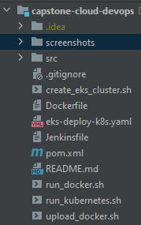

# Deploy Springboot App using Jenkins Pipeline, Amazon ECR and Amazon EKS

<div align="left">
    
</div>

## Project Overview

The goal of the project is to apply the skills and knowledge which were developed throughout the Cloud DevOps program. These include:
* Working in AWS
* Using Jenkins to implement Continuous Integration and Continuous Deployment
* Building pipelines
* Working with CloudFormation to deploy clusters
* Building Kubernetes clusters
* Building Docker containers in pipelines

## Prerequisites
## File Explanation

<div align="left">
    
</div>

- `Dockerfile`: text file that contains set of instructions for docker to automatically build an image for the app to be run in a container
- `Jenkinsfile`: text file that contains the Jenkins Pipeline configurations
- `deployment/config.yml`: file that stores dictionary of configuration settings for the application
- `deployment/deployment.yml`: file with declarative updates to application that is deployed to kubernetes cluster
- `deployment/secret.yml`: file that stores and manages sensitive information for the application, such as tokens, keys and passwords
- `deployment/service.yml`: file that defines service to be deployed to kubernetes cluster

## How to Run

### Run application standalone

* Build and run
    ``` bash
    mvn clean spring-boot:run
    ```
* Access running application at http://localhost:8080

### Run application in Docker
### Run application in Kubernetes with minikube
### Run application in Amazon Elastic Kubernetes Service (EKS)

